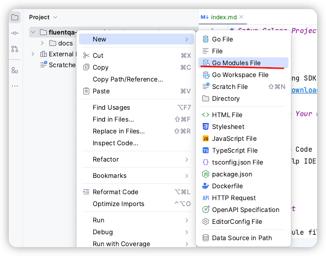

# Setup Golang Project

<!-- TOC -->
* [Setup Golang Project](#setup-golang-project)
  * [SDK](#sdk)
  * [IDE: Develop Your Golang Code](#ide-develop-your-golang-code)
  * [Setup Project](#setup-project)
  * [Run Golang Code](#run-golang-code)
  * [Coding and Testing](#coding-and-testing)
  * [How to Write Code and run tset](#how-to-write-code-and-run-tset)
  * [Retrospective](#retrospective)
<!-- TOC -->

## SDK

- Download Golang SDK
- [golang sdk download page](https://go.dev/dl/)

## IDE: Develop Your Golang Code

- Goland
- Visual Studio Code
- Cursor: AI Help IDE

---

## Setup Project

- Create go-module file

---

## Run Golang Code

- Run in cursor/vs code with Run 
- Run in Goland

---

## Coding and Testing

- Golang code
- Golang test code

---

## How to Write Code and run tset

- function
  - public/private 
- testing
  - testing lib
  - run

- ***[testify](https://github.com/stretchr/testify)***
  - How to add third party lib to your golang project

-- 

## Retrospective

- How to Create Golang Project
- How to Setup go-module
- How to Add lib to project
- How to Write A func 
- How to Run Testing

---

